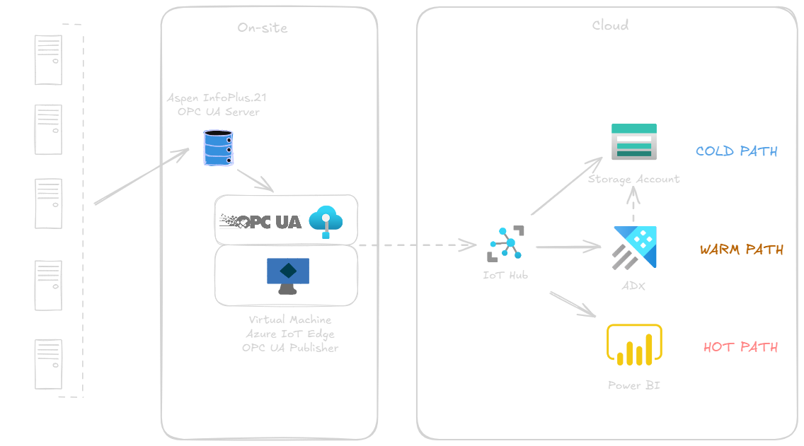

# AM workshop setup: IoT Edge (on Rpi) - OPC UA Publisher - IoT Hub

This repo consists of the configuration settings for the IoT Edge &amp; OPC UA Publisher workshop for Arcelor Mittal.

The architecture will look as follows.

### How to configure the Raspberry PI

Refer to following [config setup](./config-files/set-up-rpi.md).

### Deploy Azure IoT Edge on the Raspberry PI

Refer to following documentation for different OS:
* Linux: [link](https://learn.microsoft.com/en-us/azure/iot-edge/how-to-provision-single-device-linux-symmetric?view=iotedge-1.5&tabs=azure-portal%2Cubuntu)
* Windows: [link](https://learn.microsoft.com/en-us/azure/iot-edge/how-to-provision-single-device-linux-on-windows-symmetric?view=iotedge-1.5&tabs=azure-portal)

### Deploy the OPC UA Publisher module

https://azure.github.io/Industrial-IoT/opc-publisher/#deploy-opc-publisher-from-azure-marketplace

### Download an OPC UA Server simulator

Recommended: [ProSys OPC UA Server Simulator](https://prosysopc.com/products/opc-ua-simulation-server/)

### Config files

* [pn.json](./config-files/pn.json)

This file consists of the "published nodes" of the OPC UA Server. 

This file is basically an array, meaning that this json file can target multiple OPC UA Servers. In other words, there is a many-to-one relationship available between OPC UA Servers & the IoT Edge instance.

More information about the schema & the parameters to be set can be find here: https://github.com/Azure/Industrial-IoT/blob/main/docs/opc-publisher/readme.md#configuration-schema.

For the POC of AM: the OPC UA Server endpoint can be found here: *The base endpoint URL of the Aspen InfoPlus.21 UA server is specified in the 
OPC UA Configuration file tsk_opcua_server.opcua.config.xml.*

Example: opc.tcp://localhost:63500/InfoPlus21/OpcUa/Server

* [containerconfig.json](./config-files/containerconfig.json)

This file defines the configuration settings for a Docker container used in the IoT Edge & OPC UA Publisher setup.

The `containerconfig.json` file contains the following fields:

* Cmd: Specifies the command and arguments to run inside the container.
    * --pf=/appdata/publishednodes.json: Specifies the path to a configuration file (publishednodes.json) within the container.
    * --aa: Another argument passed to the command, the specific purpose of which depends on the application running in the container

* HostConfig: Contains configuration options for the Docker host.
    * Binds: Specifies a bind mount, mapping a directory on the host (/iiotedge) to a directory inside the container (/appdata).
    * ExtraHosts: Adds an entry to the container's /etc/hosts file, mapping the hostname DESKTOP-D585412 to the IP address 192.168.129.17.

This configuration file sets up a Docker container with specific command-line arguments, mounts a host directory to a directory inside the container, and adds a custom hostname-to-IP mapping in the container's /etc/hosts file.

More information about how to compose the file: https://github.com/Azure/Industrial-IoT/blob/main/docs/opc-publisher/readme.md#specifying-container-create-options-in-the-azure-portal

### How to connect to and read data from the InfoPlus.21 UA Server

The example steps below show how to manually read a value from the 
InfoPlus.21 UA Server. The example uses the OPC UA Foundation’s Sample 
Client application. 

Connect to the InfoPlus.21 UA Server 

    a. Launch the OPC UA Sample Client. 
    b. Click Discovery, then Servers. 
    c. Specify the host (computer) name of the InfoPlus.21 server, then click Discover. 
    d. Select AspenTech InfoPlus.21 OPC UA Server, then click OK.
    e. Click Connect. 
    f.From the Server Configuration dialog box, specify the protocol as opc.tcp, security mode as SignAndEncrypt, and security policy as Basic128Rsa15, then click OK. 

This would like the following config file: [pninfoplus.json](./config-files/pninfoplus.json).

    g. In the Open Session dialog, specify the authentication mode as UserName, then specify a Windows username and password. The username should be fully qualified, such as corp\myname. 
    h. Click OK, and then if prompted, accept the server’s certificate. 
    i. If you get the error BadSecureChannelClosed, it is because we have not yet configured the InfoPlus.21 server to trust our client’s certificate.  Follow the steps in “xxx”, xxx to add the UA Sample Client’s certificate to the list of trusted ones.

### Resources

[User-guide.pdf](./user-guide/AspenIP21OPCUAServer-V14_3-Usr.pdf)

[Microsoft OPC UA Publisher](https://github.com/Azure/Industrial-IoT/blob/main/docs/opc-publisher/readme.md)

